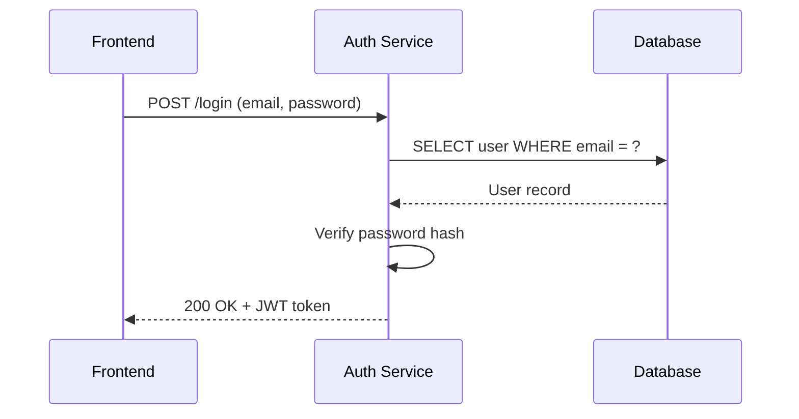
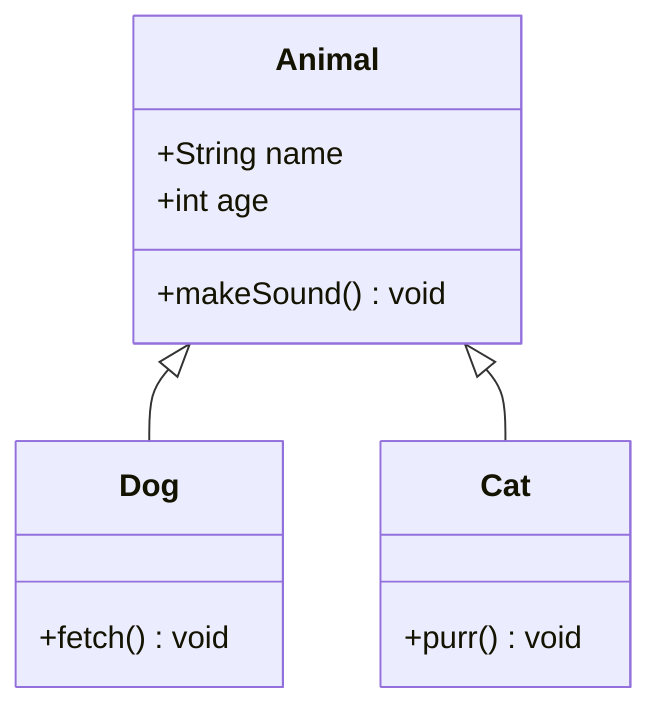
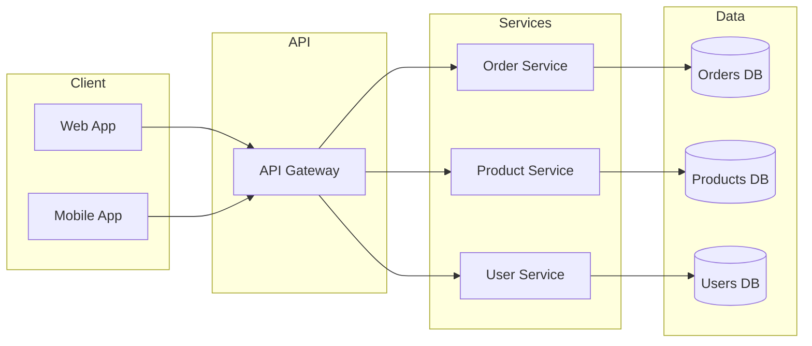

# Generate Diagram

Generates diagrams from user input — descriptions, code snippets, or local file
references. No external services required. Uses Mermaid for most diagram types
and PlantUML for proper UML2 notation (component, deployment, use case, C4).

## When to Use This Skill

Use when the user:
- Asks for any kind of diagram (sequence, flowchart, class, architecture, etc.)
- Points to code or a file and says "diagram this" or "visualize this"
- Describes a system, flow, or relationship and wants it visualized
- Needs a dependency graph, ER diagram, or state machine diagram

## Renderer Selection

| Diagram Type | Renderer | Reason |
|------|----------|--------|
| Sequence | Mermaid | Native `sequenceDiagram` syntax |
| Flowchart / Activity | Mermaid | Native `flowchart` syntax |
| Class | Mermaid | Native `classDiagram` syntax |
| State | Mermaid | Native `stateDiagram-v2` syntax |
| ER | Mermaid | Native `erDiagram` syntax |
| Architecture (layered) | Mermaid | `flowchart` with subgraphs |
| Dependency | Mermaid | `flowchart` with classDefs |
| Component | PlantUML | Proper UML2 notation (ports, interfaces) |
| Deployment | PlantUML | Native deployment diagram |
| Use Case | PlantUML | Native actors and system boundaries |
| Package | PlantUML | Proper nested package notation |
| C4 | PlantUML | C4 stdlib macros |

Always try Mermaid first. Use PlantUML only when the diagram type requires proper
UML notation that Mermaid cannot express natively.

## Workflow

### Step 1: Determine diagram type

From the user's request, determine the diagram type:

**Auto-detection rules:**
- "flow", "process", "workflow", "steps" → `flowchart`
- "API", "request", "interaction", "calls" → `sequence`
- "database", "tables", "schema", "entities" → `er`
- "classes", "inheritance", "interfaces" → `class`
- "component", "modules", "services" → `component`
- "state", "lifecycle", "transitions" → `state`
- "actors", "use case" → `usecase`
- "deployment", "infrastructure", "servers" → `deployment`
- "packages", "namespaces" → `package`
- "C4", "context", "containers" → `c4`
- "architecture", "layers", "system" → `architecture`
- "dependency", "depends on", "graph" → `dependency`

If ambiguous, ask the user.

### Step 2: Gather input

Ask the user for what you need to generate the diagram. Sources:

1. **Natural language description** — the user describes the system, flow, or relationships
2. **Code/file reference** — the user points to a file or pastes code; parse imports, classes, methods, folder structure
3. **Bullet list** — the user provides nodes/steps and their connections

If the user's initial message is vague, ask ONE focused question:
- "What are the main components/steps involved?"
- "What interacts with what?"
- "Can you list the entities and their relationships?"

Do not ask more than one clarifying question before generating a first draft.

### Step 3: Generate the diagram

**Core requirements:**
- Follow UML modeling best practices
- For Mermaid: syntax compatible with Mermaid Live Editor
- For PlantUML: syntax compatible with local PlantUML JAR
- Max 15–20 nodes per diagram — split into multiple if needed
- Use TD (top-down) for hierarchies, LR (left-right) for flows
- Dashed arrows for dependencies/async: `-.->` (Mermaid), `..>` (PlantUML)

**Color guidelines:**
- Node fills: `#E3F2FD`, `#E8F5E9`, `#FFF3E0`, `#FCE4EC`
- Text: dark for contrast (`#1A237E`, `#333`)
- Status colors (if applicable):
  - Done: `fill:#C8E6C9,color:#1B5E20`
  - In Progress: `fill:#BBDEFB,color:#0D47A1`
  - To Do: `fill:#EEEEEE,color:#424242`
  - Blocked: `fill:#FFCDD2,color:#B71C1C`

### Step 4: Present the diagram

Show:
1. **Diagram type** selected and why
2. **Code block** — full renderable Mermaid or PlantUML syntax
3. **Brief summary** of what the diagram shows

Then automatically export as PNG (Step 5). Do NOT ask before exporting.

### Step 5: Export to PNG/SVG

```bash
mkdir -p .diagrams
```

**Mermaid → PNG:**
```bash
mmdc --input .diagrams/<name>.mmd --output .diagrams/<name>.png --theme default --backgroundColor white --scale 4
```

**PlantUML → PNG:**
```bash
java -jar ~/tools/plantuml.jar -tpng -o .diagrams .diagrams/<name>.puml
```

Open the exported file after rendering.

If rendering tools are not installed, output the code block and tell the user:
- Mermaid: `npm install -g @mermaid-js/mermaid-cli`
- PlantUML: requires Java 11+ and `plantuml.jar`

### Step 6: Iterate

If the user wants changes — add/remove nodes, change type, zoom in, adjust
layout or colors — regenerate and re-export.

## Examples

### Sequence diagram from description

User: "Show me the login flow between frontend, auth service, and database"



### Class diagram from code

User: "Diagram the class structure in this file" (points to a file)



### Architecture diagram from description

User: "Show the architecture of a microservices e-commerce system"



## Edge Cases

- **Large diagrams (20+ nodes)**: Split by layer or component group into multiple diagrams
- **Vague description**: Ask one clarifying question, then generate a best-effort draft
- **Code with complex inheritance**: Focus on the main hierarchy, note omissions
- **Rendering tools not installed**: Provide the code block and installation instructions
